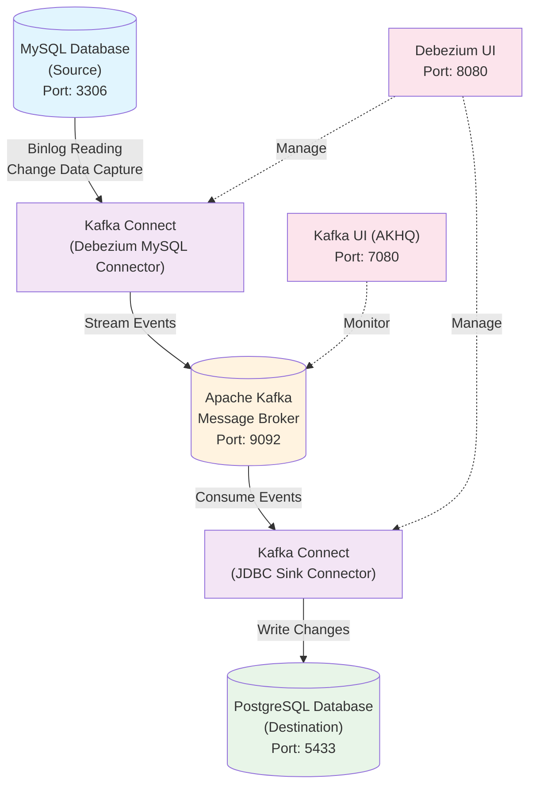

# Debezium Real-Time Data Replication Architecture

A comprehensive guide to implementing real-time Change Data Capture (CDC) using Debezium for streaming data from MySQL to PostgreSQL.

## Table of Contents

* [Architecture Overview](#architecture-overview)
* [System Topology](#system-topology)
* [Components](#components)
* [Prerequisites](#prerequisites)
* [Quick Start Guide](#quick-start-guide)
* [Configuration Files](#configuration-files)
* [Database Setup](#database-setup)
* [Connector Configuration](#connector-configuration)
* [Real-Time Data Operations](#real-time-data-operations)
* [Monitoring and Management](#monitoring-and-management)
* [Advanced Features](#advanced-features)
* [Troubleshooting](#troubleshooting)

## Architecture Overview

Debezium is an open-source distributed platform for Change Data Capture (CDC). It monitors your databases and lets applications stream every row-level change in the same order they were committed to the database.

### Key Benefits

- **Real-time streaming**: Capture changes as they happen
- **Fault tolerance**: Built on Apache Kafka for reliability
- **Low impact**: Monitor changes without modifying application code
- **Consistent ordering**: Changes are delivered in the same order they occurred
- **At-least-once delivery**: Ensures no data loss

## System Topology



## Architecture Diagram


## Components

### Core Components

1. **MySQL Database**: Source database with binlog enabled
2. **Apache Kafka**: Message broker for streaming changes
3. **Kafka Connect**: Framework for connectors
4. **Debezium MySQL Connector**: Captures MySQL changes
5. **JDBC Sink Connector**: Writes changes to PostgreSQL
6. **PostgreSQL Database**: Target database

### Management Tools

1. **Kafka UI (AKHQ)**: Web interface for Kafka management
2. **Debezium UI**: Web interface for connector management

## Prerequisites

- Docker and Docker Compose
- Basic understanding of databases and streaming concepts
- Network ports: 3306 (MySQL), 5433 (PostgreSQL), 9092 (Kafka), 8083 (Kafka Connect), 7080 (Kafka UI), 8080 (Debezium UI)

## Quick Start Guide

### 1. Set Up Environment

```bash
# Clone or navigate to your Debezium project directory
cd /path/to/debezium-project

# Set Debezium version
export DEBEZIUM_VERSION=2.7.3.Final

# Start all services
docker compose -f docker-compose-jdbc.yaml up --build -d
```

### 2. Wait for Services to Start

```bash
# Check service health
docker compose -f docker-compose-jdbc.yaml ps

# Wait for Kafka Connect to be ready
curl -H "Accept:application/json" http://localhost:8083/
```

### 3. Configure Connectors

```bash
# Start MySQL source connector
curl -i -X POST -H "Accept:application/json" -H "Content-Type:application/json" \
  http://localhost:8083/connectors/ -d @source.json

# Start PostgreSQL sink connector
curl -i -X POST -H "Accept:application/json" -H "Content-Type:application/json" \
  http://localhost:8083/connectors/ -d @jdbc-sink.json
```

### 4. Verify Setup

```bash
# Check connectors status
curl http://localhost:8083/connectors/

# Verify data in MySQL
docker compose -f docker-compose-jdbc.yaml exec mysql bash -c \
  'mysql -u root -pdebezium test -e "SELECT * FROM customers;"'

# Verify data in PostgreSQL
docker compose -f docker-compose-jdbc.yaml exec postgres bash -c \
  'psql -U postgres -d postgres -c "SELECT * FROM customers;"'
```

## Configuration Files

### Docker Compose Configuration

```yaml
# docker-compose-jdbc.yaml
services:
  kafka:
    image: apache/kafka:latest
    container_name: kafka
    environment:
      KAFKA_NODE_ID: 1
      KAFKA_PROCESS_ROLES: broker,controller
      KAFKA_LISTENERS: PLAINTEXT://0.0.0.0:9092,CONTROLLER://0.0.0.0:9093
      KAFKA_ADVERTISED_LISTENERS: PLAINTEXT://kafka:9092
      KAFKA_CONTROLLER_LISTENER_NAMES: CONTROLLER
      KAFKA_LISTENER_SECURITY_PROTOCOL_MAP: CONTROLLER:PLAINTEXT,PLAINTEXT:PLAINTEXT
      KAFKA_CONTROLLER_QUORUM_VOTERS: 1@kafka:9093
      KAFKA_OFFSETS_TOPIC_REPLICATION_FACTOR: 1
      KAFKA_TRANSACTION_STATE_LOG_REPLICATION_FACTOR: 1
      KAFKA_TRANSACTION_STATE_LOG_MIN_ISR: 1
      KAFKA_GROUP_INITIAL_REBALANCE_DELAY_MS: 0
      KAFKA_NUM_PARTITIONS: 3
    ports:
      - '9092:9092'
      - '9093:9093'
    healthcheck:
      test: ["CMD", "/opt/kafka/bin/kafka-broker-api-versions.sh", "--bootstrap-server", "localhost:9092"]
      interval: 10s
      timeout: 5s
      retries: 5

  mysql:
    image: quay.io/debezium/example-mysql:2.7.3.Final
    container_name: mysql
    ports:
      - 3306:3306
    environment:
      - MYSQL_ROOT_PASSWORD=debezium
      - MYSQL_USER=mysqluser
      - MYSQL_PASSWORD=mysqlpw 
    volumes:
      - ./scripts:/docker-entrypoint-initdb.d 

  postgres:
    image: postgres:17.6
    container_name: postgres
    ports:
      - "5433:5432"
    environment:
      - POSTGRES_USER=postgres
      - POSTGRES_PASSWORD=postgres
      - POSTGRES_DB=inventory
    command: ["postgres", "-c", "wal_level=logical", "-c", "max_wal_senders=4", "-c", "max_replication_slots=4"]
    healthcheck:
      test: ["CMD-SHELL", "pg_isready -U postgres"]
      interval: 10s
      timeout: 5s
      retries: 5
    volumes:
      - ./scripts:/docker-entrypoint-initdb.d

  debezium:
    image: quay.io/debezium/connect:latest
    restart: always
    container_name: debezium
    hostname: debezium
    depends_on:
      postgres:
        condition: service_healthy
      kafka:
        condition: service_healthy
    ports:
      - '8083:8083'
    environment:
      BOOTSTRAP_SERVERS: kafka:9092
      GROUP_ID: 1
      CONFIG_STORAGE_TOPIC: connect_configs
      STATUS_STORAGE_TOPIC: connect_statuses
      OFFSET_STORAGE_TOPIC: connect_offsets
      KEY_CONVERTER: org.apache.kafka.connect.json.JsonConverter
      VALUE_CONVERTER: org.apache.kafka.connect.json.JsonConverter
      ENABLE_DEBEZIUM_SCRIPTING: 'true'
    healthcheck:
      test:
        [
          'CMD',
          'curl',
          '--silent',
          '--fail',
          '-X',
          'GET',
          'http://localhost:8083/connectors',
        ]
      start_period: 10s
      interval: 10s
      timeout: 5s
      retries: 5

  debezium-ui:
    image: debezium/debezium-ui:latest
    platform: linux/amd64
    restart: always
    container_name: debezium-ui
    hostname: debezium-ui
    depends_on:
      debezium:
        condition: service_healthy
    ports:
      - '8080:8080'
    environment:
      KAFKA_CONNECT_URIS: http://debezium:8083

  kafka-ui:
    image: tchiotludo/akhq
    container_name: kafka-ui
    restart: unless-stopped
    environment:
      AKHQ_CONFIGURATION: |
        akhq:
          connections:
            docker-kafka-server:
              properties:
                bootstrap.servers: "kafka:9092"
              connect:
                - name: "connect"
                  url: "http://debezium:8083"
    ports:
      - 7080:8080
    depends_on:
      - kafka
```

### MySQL Source Connector Configuration

```json
# source.json
{
    "name": "customers-connector",
    "config": {
        "connector.class": "io.debezium.connector.mysql.MySqlConnector",
        "tasks.max": "1",
        "topic.prefix": "mysql-server",
        "database.hostname": "mysql",
        "database.port": "3306",
        "database.user": "root",
        "database.password": "debezium",
        "database.server.id": "184054",
        "database.include.list": "test",
        "table.include.list": "test.customers",
        "schema.history.internal.kafka.bootstrap.servers": "kafka:9092",
        "schema.history.internal.kafka.topic": "schema-changes.customers",
        "transforms": "route",
        "transforms.route.type": "org.apache.kafka.connect.transforms.RegexRouter",
        "transforms.route.regex": "([^.]+)\\.([^.]+)\\.([^.]+)",
        "transforms.route.replacement": "$3"
    }
}
```

### PostgreSQL Sink Connector Configuration

```json
# jdbc-sink.json
{
    "name": "jdbc-sink",
    "config": {
        "connector.class": "io.debezium.connector.jdbc.JdbcSinkConnector",
        "tasks.max": "1",
        "topics": "customers",
        "connection.url": "jdbc:postgresql://postgres:5432/postgres",
        "connection.username": "postgres",
        "connection.password": "postgres",
        "insert.mode": "upsert",
        "delete.enabled": "true",
        "primary.key.mode": "record_key",
        "primary.key.fields": "id",
        "schema.evolution": "basic"
    }
}
```

## Database Setup

### Customer Table Schema

```sql
-- universal-init.sql
-- Universal DDL for customers table
-- Compatible with both PostgreSQL and MySQL

CREATE TABLE IF NOT EXISTS customers (
    id INT PRIMARY KEY,
    first_name VARCHAR(50) NOT NULL,
    last_name VARCHAR(50) NOT NULL,
    email VARCHAR(100) NOT NULL UNIQUE
);

-- Insert sample data
INSERT INTO customers (id, first_name, last_name, email) VALUES
(1001, 'Sally', 'Thomas', 'sally.thomas@acme.com'),
(1002, 'George', 'Bailey', 'gbailey@foobar.com'),
(1003, 'Edward', 'Walker', 'ed@walker.com'),
(1004, 'Anne', 'Kretchmar', 'annek@noanswer.org');
```

### Database Connection Commands

```bash
# Connect to MySQL
docker compose -f docker-compose-jdbc.yaml exec mysql bash -c \
  'mysql -u root -pdebezium test'

# Connect to PostgreSQL
docker compose -f docker-compose-jdbc.yaml exec postgres bash -c \
  'psql -U postgres -d postgres'
```

## Connector Configuration

### Checking Connector Status

```bash
# List all connectors
curl http://localhost:8083/connectors/

# Check specific connector status
curl http://localhost:8083/connectors/customers-connector/status
curl http://localhost:8083/connectors/jdbc-sink/status

# View connector configuration
curl http://localhost:8083/connectors/customers-connector/config
```

### Managing Connectors

```bash
# Pause a connector
curl -X PUT http://localhost:8083/connectors/customers-connector/pause

# Resume a connector
curl -X PUT http://localhost:8083/connectors/customers-connector/resume

# Restart a connector
curl -X POST http://localhost:8083/connectors/customers-connector/restart

# Delete a connector
curl -X DELETE http://localhost:8083/connectors/customers-connector
```

## Real-Time Data Operations

### 1. Insert Operations

```sql
-- In MySQL
docker compose -f docker-compose-jdbc.yaml exec mysql bash -c \
  'mysql -u root -pdebezium test'

mysql> INSERT INTO customers VALUES(1005, 'John', 'Doe', 'john.doe@example.com');
Query OK, 1 row affected (0.02 sec)
```

**Verify in PostgreSQL:**
```bash
docker compose -f docker-compose-jdbc.yaml exec postgres bash -c \
  'psql -U postgres -d postgres -c "SELECT * FROM customers WHERE id = 1005;"'
```

### 2. Update Operations

```sql
-- In MySQL
mysql> UPDATE customers SET first_name='Jane', last_name='Roe' WHERE id = 1005;
Query OK, 1 row affected (0.02 sec)
```

**Verify in PostgreSQL:**
```bash
docker compose -f docker-compose-jdbc.yaml exec postgres bash -c \
  'psql -U postgres -d postgres -c "SELECT * FROM customers WHERE id = 1005;"'
```

### 3. Delete Operations

```sql
-- In MySQL
mysql> DELETE FROM customers WHERE id = 1005;
Query OK, 1 row affected (0.01 sec)
```

**Verify in PostgreSQL:**
```bash
docker compose -f docker-compose-jdbc.yaml exec postgres bash -c \
  'psql -U postgres -d postgres -c "SELECT COUNT(*) FROM customers WHERE id = 1005;"'
```

### 4. Bulk Operations

```sql
-- Insert multiple records
INSERT INTO customers VALUES
(1006, 'Alice', 'Smith', 'alice.smith@company.com'),
(1007, 'Bob', 'Johnson', 'bob.johnson@org.com'),
(1008, 'Charlie', 'Brown', 'charlie.brown@email.com');

-- Update multiple records
UPDATE customers SET email = CONCAT(LOWER(first_name), '.', LOWER(last_name), '@newdomain.com') 
WHERE id IN (1006, 1007, 1008);
```

## Monitoring and Management

### Web Interfaces

1. **Kafka UI (AKHQ)**: http://localhost:7080
   - Monitor Kafka topics and messages
   - View connector status
   - Browse topic data

2. **Debezium UI**: http://localhost:8080
   - Manage Debezium connectors
   - Monitor connector health
   - View connector metrics

### Kafka Topic Monitoring

```bash
# List topics
docker compose -f docker-compose-jdbc.yaml exec kafka bash -c \
  '/opt/kafka/bin/kafka-topics.sh --bootstrap-server localhost:9092 --list'

# Describe a topic
docker compose -f docker-compose-jdbc.yaml exec kafka bash -c \
  '/opt/kafka/bin/kafka-topics.sh --bootstrap-server localhost:9092 --describe --topic customers'

# Consume messages from topic
docker compose -f docker-compose-jdbc.yaml exec kafka bash -c \
  '/opt/kafka/bin/kafka-console-consumer.sh --bootstrap-server localhost:9092 --topic customers --from-beginning'
```

### Logs and Debugging

```bash
# View Debezium connector logs
docker compose -f docker-compose-jdbc.yaml logs debezium

# View MySQL logs
docker compose -f docker-compose-jdbc.yaml logs mysql

# View PostgreSQL logs
docker compose -f docker-compose-jdbc.yaml logs postgres

# Follow logs in real-time
docker compose -f docker-compose-jdbc.yaml logs -f debezium
```

## Advanced Features

### Schema Evolution

The JDBC sink connector supports basic schema evolution:

```json
{
    "schema.evolution": "basic"
}
```

This allows:
- Adding new columns
- Making nullable columns non-nullable
- Column data type widening

### Transforms

The MySQL connector uses RegexRouter transform to simplify topic names:

```json
{
    "transforms": "route",
    "transforms.route.type": "org.apache.kafka.connect.transforms.RegexRouter",
    "transforms.route.regex": "([^.]+)\\.([^.]+)\\.([^.]+)",
    "transforms.route.replacement": "$3"
}
```

This transforms `mysql-server.test.customers` → `customers`

### Custom Message Formatting

You can add custom transforms for:
- Message filtering
- Field renaming
- Data format conversion
- Custom routing logic

### Performance Tuning

```json
{
    "tasks.max": "1",
    "batch.size": "2048",
    "max.poll.records": "1000",
    "consumer.fetch.min.bytes": "1024"
}
```

## Troubleshooting

### Common Issues

1. **Connector Failed to Start**
   ```bash
   # Check connector status
   curl http://localhost:8083/connectors/customers-connector/status
   
   # View detailed error
   docker compose -f docker-compose-jdbc.yaml logs debezium
   ```

2. **Missing Data in Target Database**
   ```bash
   # Check if topic has messages
   docker compose -f docker-compose-jdbc.yaml exec kafka bash -c \
     '/opt/kafka/bin/kafka-console-consumer.sh --bootstrap-server localhost:9092 --topic customers --from-beginning --max-messages 10'
   ```

3. **Schema Mismatch Issues**
   ```bash
   # Reset connector offset (caution: data loss)
   curl -X DELETE http://localhost:8083/connectors/jdbc-sink
   # Recreate tables if needed
   ```

### Health Checks

```bash
# Check all services health
docker compose -f docker-compose-jdbc.yaml ps

# Test database connectivity
docker compose -f docker-compose-jdbc.yaml exec mysql bash -c 'mysqladmin ping -h localhost -u root -pdebezium'
docker compose -f docker-compose-jdbc.yaml exec postgres bash -c 'pg_isready -U postgres'

# Test Kafka connectivity
curl http://localhost:8083/connectors
```

### Recovery Procedures

```bash
# Restart specific service
docker compose -f docker-compose-jdbc.yaml restart debezium

# Full system restart
docker compose -f docker-compose-jdbc.yaml down
docker compose -f docker-compose-jdbc.yaml up -d

# Clean restart (removes volumes)
docker compose -f docker-compose-jdbc.yaml down -v
docker compose -f docker-compose-jdbc.yaml up --build -d
```

## Shutdown

```bash
# Graceful shutdown
docker compose -f docker-compose-jdbc.yaml down

# Remove volumes (complete cleanup)
docker compose -f docker-compose-jdbc.yaml down -v

# Remove images
docker compose -f docker-compose-jdbc.yaml down --rmi all -v
```

---

## Additional Resources

- [Debezium Documentation](https://debezium.io/documentation/)
- [Kafka Connect Documentation](https://kafka.apache.org/documentation/#connect)
- [MySQL Binlog Configuration](https://debezium.io/documentation/reference/stable/connectors/mysql.html)
- [PostgreSQL JDBC Connector](https://debezium.io/documentation/reference/stable/connectors/jdbc.html)

## Support

For issues and questions:
- Check the logs: `docker compose -f docker-compose-jdbc.yaml logs [service-name]`
- Visit web interfaces for real-time monitoring
- Consult official Debezium documentation
- Review connector configurations for compatibility
