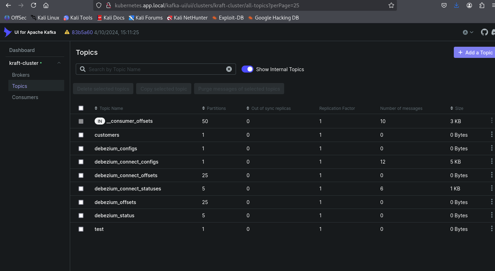
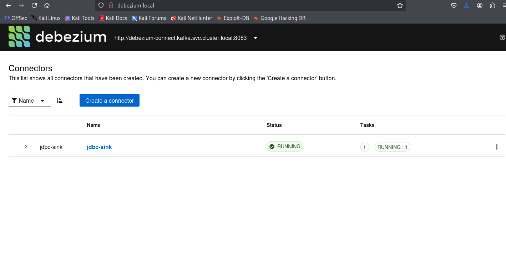
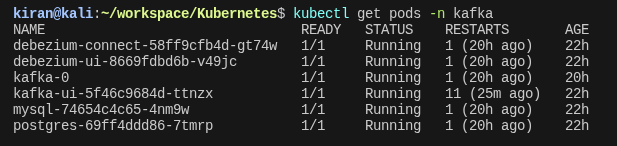
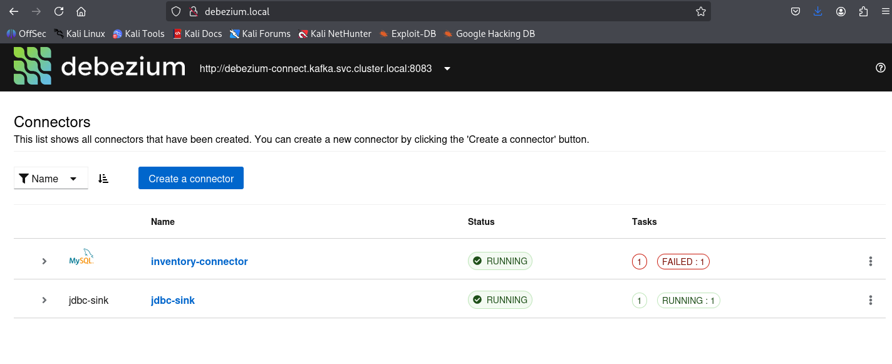
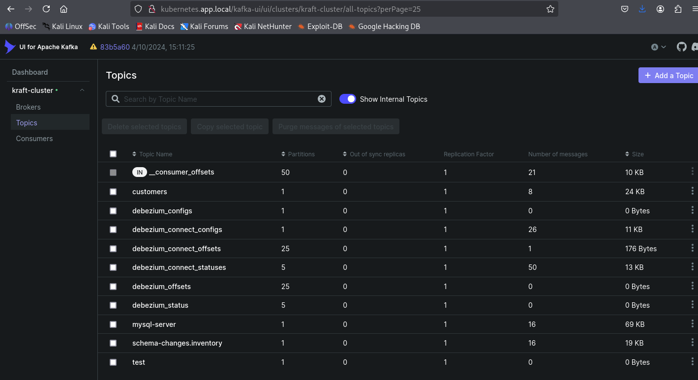
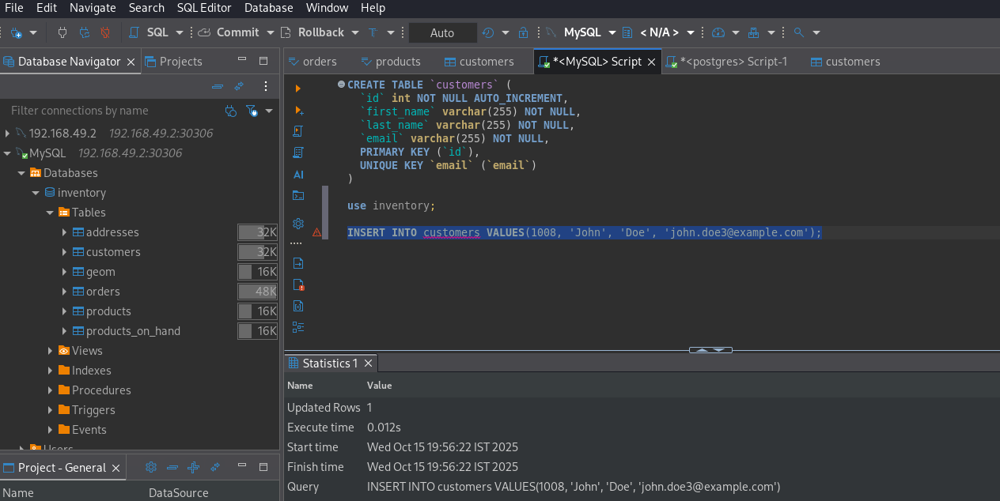
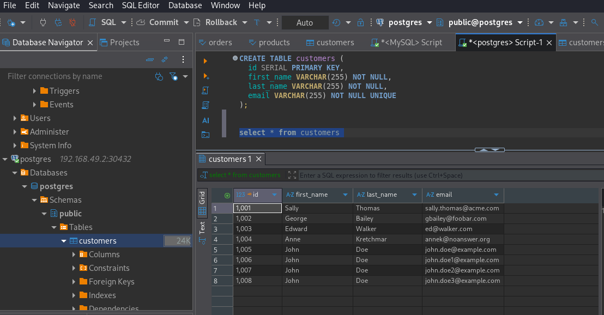

# Kafka Setup in Minikube

This guide explains how to set up Kafka and related tools in Minikube and access them from your host machine.

## Prerequisites

- Minikube installed
- kubectl installed
- A running Minikube cluster

## Setup Steps

1. Start Minikube (if not already running):
```bash
minikube start
```

2. Enable Ingress Controller:
```bash
minikube addons enable ingress
```

3. Create Kafka namespace:
```bash
kubectl create namespace kafka
```

4. Apply all Kafka resources:
```bash
kubectl apply -f ./
```

## Accessing Services

### 1. Add Host Entry
Get Minikube IP and add it to /etc/hosts:
```bash
echo "$(minikube ip) kubernetes.app.local" | sudo tee -a /etc/hosts
```

### 2. Access Web UIs
- Kafka UI: http://kubernetes.app.local/kafka-ui
- Debezium UI: http://kubernetes.app.local/debezium-ui

### 3. Kafka Bootstrap Server
- From inside the cluster: `kafka-svc.kafka.svc.cluster.local:9094`
- From host machine: `<minikube-ip>:30032`

To get your Minikube IP:
```bash
minikube ip
```

## Verifying the Setup

1. Check all resources are running:
```bash
kubectl -n kafka get all
```

2. Check Ingress status:
```bash
kubectl -n kafka get ingress
```

3. Verify Kafka is running:
```bash
kubectl -n kafka logs -l app=kafka
```

## Troubleshooting

1. If services are not accessible, check Ingress status:
```bash
kubectl -n kafka describe ingress kafka-ing
```

2. Check Kafka logs:
```bash
kubectl -n kafka logs -l app=kafka
```

3. Check Kafka UI logs:
```bash
kubectl -n kafka logs -l app=kafka-ui
```

## Configuration Details

### Kafka Service
- Internal port: 9094
- NodePort: 30032
- Service type: NodePort

### Kafka UI
- Accessible at: /kafka-ui
- Service type: ClusterIP
- Port: 8080




### Debezium Service
- Internal port: 8083
- Service type: ClusterIP

### Debezium UI
- Accessible at: /
- Service type: ClusterIP
- Port: 8080




### Execute below :

### Create tables in both the database

**In MySQL**

```sql
CREATE TABLE `customers` (
  `id` int NOT NULL AUTO_INCREMENT,
  `first_name` varchar(255) NOT NULL,
  `last_name` varchar(255) NOT NULL,
  `email` varchar(255) NOT NULL,
  PRIMARY KEY (`id`),
  UNIQUE KEY `email` (`email`)
)
```


**In Postgres :**
```sql
CREATE TABLE customers (
  id SERIAL PRIMARY KEY,
  first_name VARCHAR(255) NOT NULL,
  last_name VARCHAR(255) NOT NULL,
  email VARCHAR(255) NOT NULL UNIQUE
);
```

### Copy the JSON file to the pod

**Get the pod debezium pod name**

```bash
get pods -n kafka 
```




```bash
kubectl cp jdbc-sink.json debezium-connect-58ff9cfb4d-gt74w:/tmp/jdbc-sink.json -n kafka
```

### Execute the curl command

```bash
kubectl exec -it debezium-connect-58ff9cfb4d-gt74w -n kafka -- curl -i -X POST \
  -H "Accept:application/json" \
  -H "Content-Type:application/json" \
  http://localhost:8083/connectors/ \
  -d @/tmp/jdbc-sink.json
```

```bash
kubectl cp source.json debezium-connect-58ff9cfb4d-gt74w:/tmp/source.json -n kafka
```

### Execute the curl command

```bash
kubectl exec -it debezium-connect-58ff9cfb4d-gt74w -n kafka -- curl -i -X POST \
  -H "Accept:application/json" \
  -H "Content-Type:application/json" \
  http://localhost:8083/connectors/ \
  -d @/tmp/source.json
```

```bash
kubectl exec -it debezium-connect-58ff9cfb4d-gt74w -n kafka -- curl DELETE \
    http://localhost:8083/api/connectors/1/inventory-connector
```













## Production Environment Setup

### 1. Security Configurations

#### Kafka Security
- Enable TLS encryption for inter-broker and client communication
- Configure SASL authentication (PLAIN, SCRAM, or Kerberos)
- Setup ACLs for topic authorization
- Use SSL certificates signed by a trusted CA

```yaml
# Example Kafka security config
KAFKA_SSL_KEYSTORE_LOCATION: "/etc/kafka/secrets/kafka.server.keystore.jks"
KAFKA_SSL_KEYSTORE_PASSWORD: "${KEYSTORE_PASSWORD}"
KAFKA_SSL_KEY_PASSWORD: "${KEY_PASSWORD}"
KAFKA_SSL_TRUSTSTORE_LOCATION: "/etc/kafka/secrets/kafka.server.truststore.jks"
KAFKA_SSL_TRUSTSTORE_PASSWORD: "${TRUSTSTORE_PASSWORD}"
KAFKA_SECURITY_INTER_BROKER_PROTOCOL: "SSL"
KAFKA_SSL_CLIENT_AUTH: "required"
```

#### Network Security
- Use Network Policies to restrict pod communication
- Enable mTLS between services using service mesh (like Istio)
- Configure proper ingress TLS termination
- Use private container registries

### 2. High Availability

#### Kafka Cluster
- Minimum 3 Kafka brokers
- Distribute across different availability zones
- Configure proper replication factor (at least 3)
- Enable rack awareness

```yaml
spec:
  replicas: 3
  podAntiAffinity:
    requiredDuringSchedulingIgnoredDuringExecution:
      - labelSelector:
          matchExpressions:
            - key: app
              operator: In
              values:
                - kafka
        topologyKey: "kubernetes.io/hostname"
```

#### ZooKeeper (if used)
- Deploy minimum 3 nodes
- Configure proper quorum settings
- Enable snapshots and transaction logs backup

### 3. Resource Management

#### Container Resources
- Set appropriate resource requests and limits
- Configure pod disruption budgets
- Implement horizontal pod autoscaling

```yaml
resources:
  requests:
    memory: "8Gi"
    cpu: "2000m"
  limits:
    memory: "16Gi"
    cpu: "4000m"
```

#### Storage
- Use SSD-backed persistent volumes
- Implement proper backup strategy
- Configure volume snapshots
- Monitor disk usage

```yaml
volumeClaimTemplates:
  - metadata:
      name: data
    spec:
      accessModes: [ "ReadWriteOnce" ]
      storageClassName: "ssd-storage-class"
      resources:
        requests:
          storage: 100Gi
```

### 4. Monitoring and Logging

#### Metrics
- Deploy Prometheus for metrics collection
- Configure Grafana dashboards
- Set up alerts for critical metrics
- Monitor JVM metrics

#### Logging
- Implement centralized logging (ELK/EFK stack)
- Configure log rotation
- Set up log aggregation
- Enable audit logging

### 5. Backup and Recovery

- Regular backup of Kafka topics
- Implement disaster recovery plan
- Test backup restoration regularly
- Configure cross-region replication

### 6. Performance Tuning

#### Kafka Optimization
- Tune GC parameters
- Optimize topic partitions
- Configure proper retention policies
- Enable compression

```yaml
env:
  - name: KAFKA_OPTS
    value: >
      -XX:+UseG1GC 
      -XX:MaxGCPauseMillis=20 
      -XX:InitiatingHeapOccupancyPercent=35 
      -XX:+ExplicitGCInvokesConcurrent
```

#### Network Optimization
- Configure appropriate TCP keepalive settings
- Optimize network policies
- Monitor network latency
- Configure proper buffer sizes

### 7. CI/CD Considerations

- Implement Infrastructure as Code
- Use sealed secrets for sensitive data
- Configure proper RBAC
- Implement blue-green deployments
- Regular security scanning of images

### 8. Compliance and Auditing

- Implement data encryption at rest
- Configure audit logging
- Set up compliance monitoring
- Regular security audits
- Data retention policies


Issue:
{"error_code":500,"message":"Request timed out. The worker is currently ensuring membership in the cluster, which began at 2025-10-14T15:25:01.075Z"}
Solution: 

The solution? Configure Kafka correctly :) Since I was using Docker Compose for my cluster I set:

KAFKA_OFFSETS_TOPIC_REPLICATION_FACTOR: 1


https://rmoff.net/2019/11/29/kafka-connect-request-timed-out/
